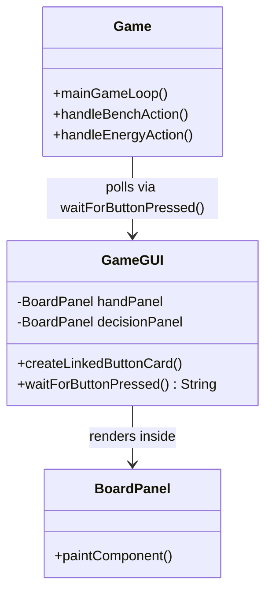
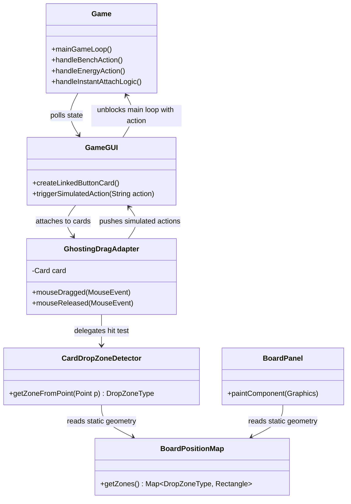
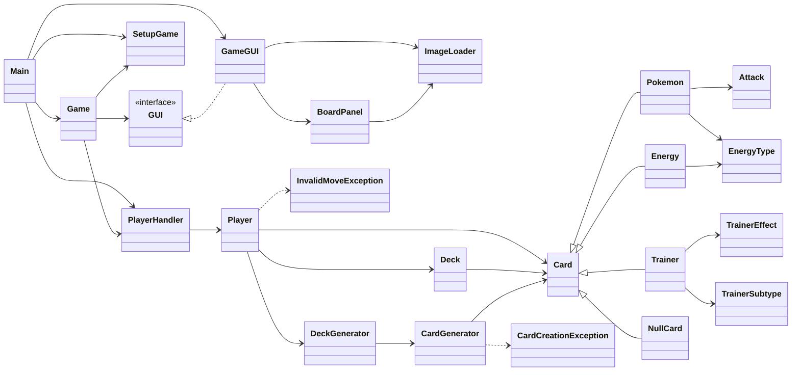
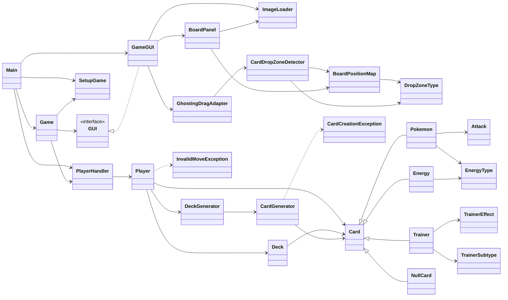

# Implement Drag and Drop for Cards from Hand to Battlefield

This implementation plan is organized sequentially, starting from the high-level user experience features and stepping downwards into the specific architectural layouts, component dictionaries, and finally the overarching System-Level diagrams.

## User Action Required

> [!WARNING]
> The layout has been explicitly reorganized to match your exact structural flow notes, and I have expanded the TDD section drastically with actionable test targets. Please review safely and let me know if you approve this finalized plan so we can begin coding!

---

## 1. High-Level Feature Overview

The core objective is to replace rigid click-menus with fluid drag-and-drop gameplay, massively accelerating Turn Actions while bypassing repetitive confirmation prompts.

### 1.1 Drag and Drop Interaction Rules
This table outlines exactly how sweeping a card across the UI translates seamlessly into a game-state action.

| Dragged Card Variant | Drop Target | Resulting System Action |
| :--- | :--- | :--- |
| **Basic Pokémon** | Valid Empty Bench Slot | Automatically places on Bench. "Add to Bench" popup skipped. |
| **Basic Pokémon** | Active Slot (if empty) | Triggers "Make Active" system action. |
| **Stage 1 or 2 Pokémon** | Valid Benched / Active base | Triggers "Evolve" sequence directly if the target matches its pre-evolution rules. |
| **Energy Card** | Any Valid Pokémon | Attaches energy directly to the targeted Pokémon. "Select Pokémon for energy" popups bypassed. |
| **Trainer (Potion)** | Any Valid Pokémon | Triggers heal directly onto the targeted Pokémon. Selection popup bypassed. |
| **Trainer (Switch)** | Benched Pokémon | Triggers `Switch` logic, immediately replacing the Active target with the Benched target. |
| **Any Card** | Invalid Void (Background, Deck) | **Test Requirement:** Ensures action is correctly rejected, snapping the card safely back to the player hand cleanly (Action cancelled). |
| **Any Card** | Unauthorized Area (Opponent's Side) | **Test Requirement:** Specifically verifies that attempts to drop items into unauthorized enemy zones natively reject the action. |

### 1.2 Retained Sub-Menu Buttons (Legacy States)
Since not all turn actions originate from a card in the hand, the following global buttons will elegantly remain available natively on the `decisionPanel`:
1. **Pass Turn** (Must remain a global button click)
2. **Attack** (Handled by selecting Active, clicking Attack, clicking enemy)
3. **Retreat** (Handled via board-level states, not hand dragging)
4. **Card Info** (Clicking a card instead of clicking-and-dragging will still show basic information sub-elements)

---

## 2. GUI Subsystem (Original Tight Coupling)

Before applying fixes, the `BoardPanel` originally did all internal math limiting physical zone detection.

---

## 3. TDD & Sprout Class Strategy 

To resolve the tightly-coupled architecture above, this details exactly how we will rigorously execute writing the codebase using standard "Red-Green-Refactor":

### Phase 1: Pure Data Structure (Decoupling Geometry)
*   **TDD Goal:** Write `BoardPositionMapTest.java` that expects standard screen sizes (e.g., `1200x900`) to return explicitly calculated absolute `Rectangles` representing `DropZoneType.P1_ACTIVE` and the bench spots.
*   **Implementation Focus:** Build `BoardPositionMap` using a static `EnumMap`. Cut the magic-math logic out of `BoardPanel.paintComponent`, replacing local variables with `boardPositionMap.getZones().get(DropZoneType.P1_BENCH_0)` to eliminate formatting duplication (resolving Smell #2: Long Method).

### Phase 2: Area Detection (`CardDropZoneDetector`)
*   **TDD Goal:** Write `CardDropZoneDetectorTest.java` mocking precise boundary intersection. Pass in raw `Point(x,y)` inputs mimicking an explicit valid target and assert an accurate `DropZoneType` is returned. **Crucially**, pass points outside bounds and opponent zones ensuring it accurately intercepts and rejects invalid drops by returning `NONE`.
*   **Implementation Focus:** Build `CardDropZoneDetector` that strictly iterates through `BoardPositionMap` utilizing `Rectangle.contains(Point)` checking. Guarantees business intent resolves perfectly independent of Swing UI components.

### Phase 3: The Drag Component (`GhostingDragAdapter`)
*   **TDD Goal:** Using `EasyMock`, write `GhostingDragAdapterTest.java` intercepting `MouseEvent.MOUSE_RELEASED`. Mock `GameGUI` interactions and verify that simulating a release over specific mapped coordinates successfully invokes `GameGUI.triggerSimulatedAction` exactly as requested.
*   **Implementation Focus:** Extend `MouseAdapter`. `mousePressed()` binds the thumbnail image. `mouseDragged()` manipulates a Swing `GlassPane` (or JLayeredPane) to mirror the Image across visual space relative to the cursor. `mouseReleased()` executes the `CardDropZoneDetector` inquiry and terminates the ghosting state cleanly.

### Phase 4: Integrations & Instant Mechanics
*   **TDD Goal:** Implement sub-tests within the existing `GameTest.java` determining that passing instant attach payloads successfully modifies Player and Card states (Healing, Evolution, Energy Attachment) whilst bypassing intermediate dialog trees entirely.
*   **Implementation Focus:** Refactor `Game.java` to accept targeted intents. Modify `GameGUI.createLinkedButtonCard` to instantiate and natively register the new `GhostingDragAdapter`. Seamlessly proxy the drag-release events into the existing Spin Loop resolution `waitForButtonPressed()` to safely unblock threaded logic.

---

## 4. GUI Subsystem (Implementation via Decoupling)

Following the completion of the phases above, static geometry maps are built separately so both the Render Engine (`BoardPanel`) and the Interaction Engine (`CardDropZoneDetector`) can share coordinates independently.

---

## 5. Component Instantiation Dictionary

Diving into low-level implementation details, this maps exactly which classes and methods will be built during the TDD phases.

| Class / Enum Name | Component / Method Name | Parameters | Returns | Purpose |
| :--- | :--- | :--- | :--- | :--- |
| **DropZoneType (Enum)** | N/A | N/A | N/A | Enum denoting `P1_ACTIVE`, `P1_BENCH_X`, `NONE`, representing static zones. |
| **BoardPositionMap** | `Constructor` | `int width`, `int height` | `void` | Evaluates static math geometry (e.g. `cardWidth`) out of inputs. |
| **BoardPositionMap** | `getZones()` | None | `Map<DropZoneType, Rectangle>` | Retrieves purely calculated bounding boxes for drop detection and painting. |
| **CardDropZoneDetector** | `Constructor` | `BoardPositionMap map` | `void` | Sets up the hit-test resolver. |
| **CardDropZoneDetector** | `getZoneFromPoint()` | `Point screenPoint` | `DropZoneType` | Loops over the `BoardPositionMap` Rectangles, returning which logic sector the mouse released into. |
| **GhostingDragAdapter** | `Constructor` | `GameGUI gui`, `Card card` | `void` | Binds the specific Card data directly to its physical button drag behaviors. |
| **GhostingDragAdapter** | `mousePressed()` | `MouseEvent e` | `void` | Overrides native Swing: Prepares layered pane thumbnail mirroring the exact Card `url`. |
| **GhostingDragAdapter** | `mouseDragged()` | `MouseEvent e` | `void` | Overrides native Swing: Syncs GlassPane/LayeredPane image to track perfectly beneath the cursor. |
| **GhostingDragAdapter** | `mouseReleased()` | `MouseEvent e` | `void` | Disables ghosting. Coordinates are piped into `CardDropZoneDetector`. If a valid zone returns, issues proxy commands to `GameGUI`. |
| **GameGUI (Modify)** | `attachDragAdapter()` | `JButton btn`, `Card c` | `void` | New method abstracting the attachment of the listener away from standard card generation. |
| **GameGUI (Modify)** | `triggerSimulatedAction()`| `String action` | `void` | Synthetically fulfills the `waitForAction` block normally triggered by legacy UI Decision Buttons. |

---

## 6. System-Level Architecture

For absolute structural clarity across the entire repository, the following diagrams model every single class in the project before and after introducing our new drag-and-drop utilities. 

### 6.1 Complete System Hierarchy (Before Integration)

### 6.2 Complete System Hierarchy (After Drag & Drop Integration)

Notice how the new components (`BoardPositionMap`, `CardDropZoneDetector`, `GhostingDragAdapter`) inject functionally isolated behaviors without tangling core logic or mutating how generic Cards or Players operate.

